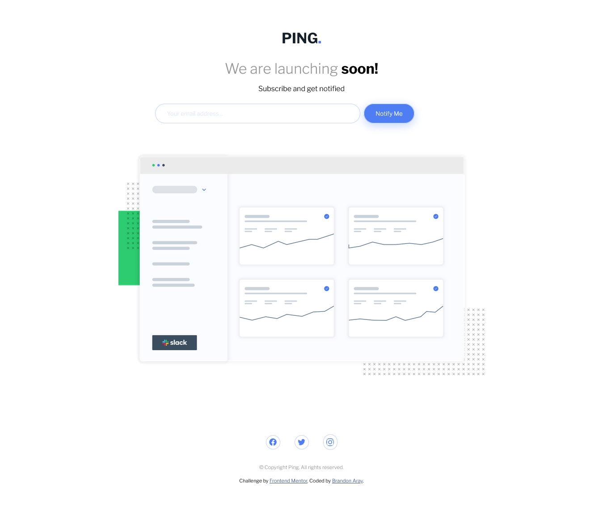

# Frontend Mentor - Ping coming soon page solution

This is a solution to the [Ping coming soon page challenge on Frontend Mentor](https://www.frontendmentor.io/challenges/ping-single-column-coming-soon-page-5cadd051fec04111f7b848da). Frontend Mentor challenges help you improve your coding skills by building realistic projects.

## Table of contents

- [Overview](#overview)
  - [The challenge](#the-challenge)
  - [Screenshot](#screenshot)
  - [Links](#links)
- [My process](#my-process)
  - [Built with](#built-with)
  - [What I learned](#what-i-learned)
  - [Continued development](#continued-development)
  - [Useful resources](#useful-resources)
- [Author](#author)

## Overview

### The challenge

Users should be able to:

- View the optimal layout for the site depending on their device's screen size
- See hover states for all interactive elements on the page
- Submit their email address using an `input` field
- Receive an error message when the `form` is submitted if:
  - The `input` field is empty. The message for this error should say _"Whoops! It looks like you forgot to add your email"_
  - The email address is not formatted correctly (i.e. a correct email address should have this structure: `name@host.tld`). The message for this error should say _"Please provide a valid email address"_

### Screenshot

### Links

- Solution URL: https://github.com/branalex94/ping-coming-soon-page
- Live Site URL:

## My process

### Built with

- Semantic HTML5 markup
- CSS custom properties
- Flexbox
- Mobile-first workflow

### What I learned

I learned a very simple way to handle the same input input error over different device sizes.

### Continued development

I'd like to keep focusing on form handling as well as better implementation of images for faster loading times.

### Useful resources

- [Email validation RegEx](https://www.w3resource.com/javascript/form/email-validation.php#:~:text=To%20get%20a%20valid%20email,%5D%2B)\*%24%2F.) - This helped me have a fast implementation of an email validation regular expression.

## Author

- GitHub - [branalex94](https://www.github.com/branalex94)
- Frontend Mentor - [@branalex94](https://www.frontendmentor.io/profile/branalex94)
